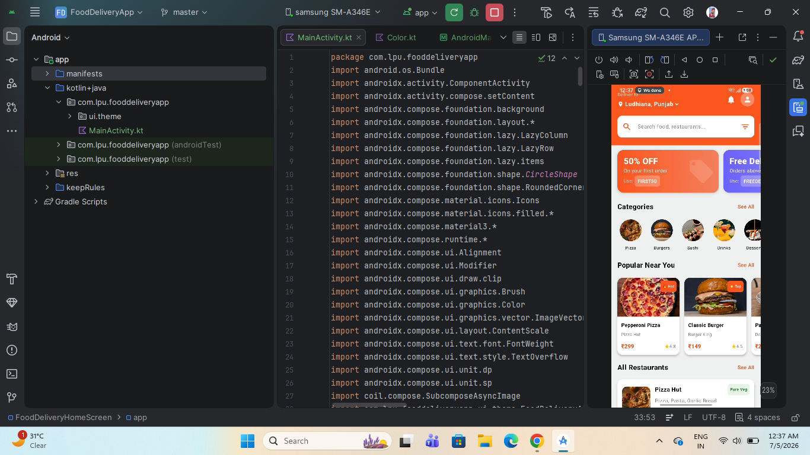
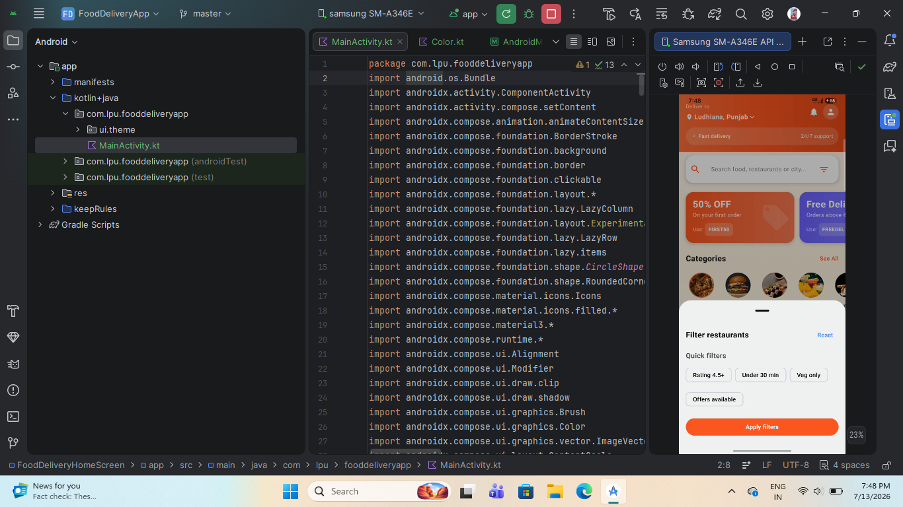

# 🍔 Food Delivery App UI

A modern Android **Food Delivery Application UI** built using **Kotlin** and **Jetpack Compose**. The app showcases a clean, responsive, and user-friendly interface with food categories, promotional offers, popular dishes, and restaurant listings. It demonstrates modern Android UI development using Material 3 components and reusable composables.

---

## Features

* Modern Food Delivery Home Screen
* Interactive Search Bar
* Promotional Offer Banners
* Food Categories
* Popular Food Section
* Restaurant Listing Cards
* Online Food Images using Coil
* Responsive Jetpack Compose UI
* Material 3 Design Components
* Smooth LazyColumn & LazyRow Scrolling

---

## Technologies Used

* Kotlin
* Jetpack Compose
* Material 3
* Coil Image Loading
* LazyColumn
* LazyRow
* State Management
* Android Studio

---

```
app/
│
├── MainActivity.kt
├── ui/
│   └── theme/
├── models/
│   ├── Category.kt
│   ├── FoodItem.kt
│   ├── Restaurant.kt
│   └── Offer.kt
└── AndroidManifest.xml
```

---

# 📱 Screenshots

<p align="center">
  
  
  &nbsp;&nbsp;&nbsp;
</p>

---

## Project Structure

### MainActivity

Responsible for:

* Launching the application
* Setting the Compose theme
* Displaying the Home Screen

### Home Screen

Responsible for:

* Showing delivery location
* Displaying search functionality
* Showing promotional offers
* Displaying food categories
* Listing popular dishes
* Showing restaurant cards

### FoodImage

Responsible for:

* Loading online food images using Coil
* Displaying fallback icons if images fail to load

### Data Models

Contains:

* Category
* Offer
* FoodItem
* Restaurant

---

## UI Components

### Top Bar

Displays:

* Delivery location
* Notifications
* User profile icon

### Search Bar

Provides:

* Food search
* Restaurant search
* Filter option

### Offer Banner

Displays:

* Discount offers
* Promo codes
* Attractive gradient cards

### Categories

Displays:

* Pizza
* Burgers
* Sushi
* Drinks
* Desserts
* Salads

### Popular Near You

Displays:

* Popular food items
* Ratings
* Prices
* Restaurant names

### Restaurant List

Displays:

* Restaurant name
* Cuisine
* Delivery time
* Ratings
* Minimum order amount
* Veg/Non-Veg tag

---

## Future Improvements

* User Authentication
* Food Details Screen
* Shopping Cart
* Checkout & Payment
* Order Tracking
* Favorites
* Search Functionality
* Firebase Integration
* Dark Mode Support
* Profile Screen

---

## Installation

Clone the repository:

```bash
git clone https://github.com/yourusername/FoodDeliveryApp.git
```

Open the project in Android Studio.

Build and Run on an Android device or emulator.

---

## Screenshots

Place your screenshots inside the project folder:

```
FoodDeliveryApp/
│
├── README.md
├── food1.png
├── food2.png
```

---

## Learning Outcomes

This project demonstrates practical knowledge of:

* Jetpack Compose
* Material 3
* LazyColumn & LazyRow
* State Management
* Reusable Composable Functions
* Image Loading with Coil
* Responsive UI Design
* Modern Android Development

---

## Author

**Vishal Dhiman**

**B.Tech Student | Android Developer**

Passionate about Android Development, Kotlin, Jetpack Compose, and building modern, responsive mobile applications.
